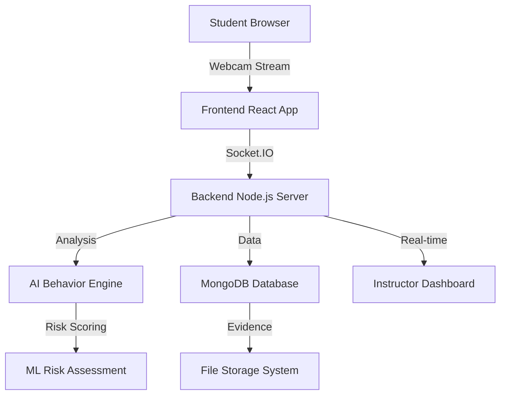

# CanYouCheat - AI-Enhanced Online Exam Proctoring System

[](https://opensource.org/licenses/MIT)
[](https://nodejs.org/)
[](https://reactjs.org/)
[](https://www.mongodb.com/)
[](https://socket.io/)

> **Advanced AI-powered exam proctoring system that ensures academic integrity through real-time behavior analysis, webcam monitoring, and intelligent risk assessment.**

## Table of Contents

- [Overview](#overview)
- [Features](#features)
- [System Architecture](#system-architecture)
- [Tech Stack](#tech-stack)
- [Quick Start](#quick-start)
- [Project Structure](#project-structure)
- [API Documentation](#api-documentation)
- [Contributing](#contributing)
- [License](#license)

## Overview

CanYouCheat is a comprehensive AI-Enhanced Online Exam Proctoring System designed to maintain academic integrity in remote examinations. The system leverages advanced computer vision, machine learning, and real-time monitoring to detect suspicious behavior patterns and ensure fair testing environments.

### Key Objectives
- **Detect suspicious behavior** during online exams
- **Automate proctoring** for large-scale assessments
- **Reduce costs** of human proctors
- **Work with low bandwidth** connections
- **Detect multiple cheating methods** simultaneously
- **Store evidence** for later review and analysis

## Features

### AI-Powered Monitoring
- **Face Detection & Tracking** - Real-time facial recognition and movement analysis
- **Eye Movement Analysis** - Advanced gaze tracking to detect looking away patterns
- **Voice & Audio Detection** - Background noise and conversation monitoring
- **Multiple Person Detection** - Ensures test-taker isolation
- **Behavioral Pattern Recognition** - ML-based suspicious activity identification

### Advanced Analytics
- **Real-time Risk Scoring** - Dynamic behavior-based risk assessment
- **Evidence Collection** - Automated screenshot and video evidence capture
- **Comprehensive Reporting** - Detailed post-exam analysis and reports
- **Performance Dashboards** - Instructor and student analytics

### Security & Integrity
- **Browser Activity Monitoring** - Prevents unauthorized tab switching
- **Screen Recording Detection** - Identifies screen capture attempts
- **Webcam & Microphone Control** - Mandatory AV device access
- **Secure Authentication** - JWT-based role-based access control

### User Experience
- **Responsive Design** - Works across desktop, tablet, and mobile devices
- **Real-time Notifications** - Instant alerts for suspicious activities
- **Multi-language Support** - Internationalization ready
- **Accessibility Compliant** - WCAG 2.1 AA standards

## System Architecture



### Workflow Process
1. **Pre-Exam Setup** → System check, webcam/microphone verification
2. **Real-time Monitoring** → Continuous AI behavior analysis during exam
3. **Risk Assessment** → Dynamic scoring based on detected behaviors
4. **Evidence Collection** → Automated capture of suspicious activities
5. **Post-Exam Review** → Comprehensive reporting and manual review

## Tech Stack

### Backend
- **Runtime**: Node.js 16+
- **Framework**: Express.js
- **Database**: MongoDB with Mongoose ODM
- **Authentication**: JWT + Passport.js
- **Real-time**: Socket.IO
- **AI/ML**: TensorFlow.js, OpenCV, DeepFace, YOLOv8
- **File Storage**: Multer + GridFS

### Frontend
- **Framework**: React 18.2+
- **State Management**: Context API
- **Styling**: CSS3 + CSS Grid/Flexbox
- **Media**: WebRTC API for webcam access
- **Real-time**: Socket.IO Client
- **Routing**: React Router v6

### DevOps & Tools
- **Version Control**: Git + GitHub
- **Package Manager**: npm
- **Testing**: Jest + React Testing Library
- **Code Quality**: ESLint + Prettier
- **Documentation**: JSDoc

## Quick Start

### Prerequisites
- Node.js (v16.0.0 or higher)
- MongoDB (v4.4 or higher)
- npm or yarn package manager
- Modern browser with WebRTC support

### Installation

1. **Clone the repository**
```bash
git clone https://github.com/VivekChaudhary111/CanYouCheat.git
cd CanYouCheat
```

2. **Backend Setup**
```bash
cd backend
npm install
cp .env.example .env
# Configure your environment variables
npm run dev
```

3. **Frontend Setup**
```bash
cd ../frontend
npm install
npm start
```

4. **Access the Application**
- Frontend: http://localhost:3000
- Backend API: http://localhost:5000
- Documentation: http://localhost:5000/api-docs

### Environment Variables

Create `.env` file in the backend directory:

```env
# Server Configuration
PORT=5000
NODE_ENV=development

# Database
MONGO_URI=mongodb://localhost:27017/canyoucheat

# Authentication
JWT_SECRET=your-super-secret-jwt-key
JWT_EXPIRE=24h

# File Upload
MAX_FILE_SIZE=10MB
UPLOAD_PATH=./uploads

# AI Configuration
AI_CONFIDENCE_THRESHOLD=0.7
RISK_SCORE_THRESHOLD=75
```

## Project Structure

```
CanYouCheat/
├── backend/                 # Backend Node.js application
│   ├── src/
│   │   ├── controllers/     # Request handlers
│   │   ├── models/         # Database models
│   │   ├── routes/         # API routes
│   │   ├── middlewares/    # Custom middleware
│   │   ├── services/       # Business logic
│   │   ├── ai/            # AI/ML components
│   │   ├── socket/        # Real-time communication
│   │   └── utils/         # Utility functions
│   ├── tests/             # Backend tests
│   └── README.md          # Backend documentation
├── frontend/               # Frontend React application
│   ├── src/
│   │   ├── components/     # Reusable UI components
│   │   ├── pages/         # Page components
│   │   ├── context/       # React context providers
│   │   ├── hooks/         # Custom React hooks
│   │   ├── services/      # API services
│   │   └── utils/         # Utility functions
│   ├── public/            # Static assets
│   └── README.md          # Frontend documentation
├── docs/                  # Project documentation
├── README.md              # Main project documentation
└── .github/               # GitHub workflows and templates
```

## API Documentation

### Authentication Endpoints
```http
POST /api/auth/login          # User login
POST /api/auth/register       # User registration
GET  /api/auth/verify         # Token verification
POST /api/auth/logout         # User logout
```

### Exam Management
```http
GET    /api/exams             # Get all exams
POST   /api/exams             # Create new exam
GET    /api/exams/:id         # Get exam details
PUT    /api/exams/:id         # Update exam
DELETE /api/exams/:id         # Delete exam
```

### Proctoring & Monitoring
```http
POST /api/proctoring/start    # Start proctoring session
POST /api/proctoring/analyze  # Submit behavior data
GET  /api/proctoring/report   # Get proctoring report
```

For detailed API documentation, visit: `http://localhost:5000/api-docs`

## Testing

### Run Backend Tests
```bash
cd backend
npm test                      # Run all tests
npm run test:watch           # Run tests in watch mode
npm run test:coverage        # Run tests with coverage
```

### Run Frontend Tests
```bash
cd frontend
npm test                     # Run all tests
npm run test:coverage        # Run tests with coverage
```

## Deployment

### Production Build
```bash
# Backend
cd backend
npm run build

# Frontend
cd frontend
npm run build
```

### Docker Deployment
```bash
# Build and run with Docker Compose
docker-compose up --build
```

## Contributing

We welcome contributions! Please see our [Contributing Guidelines](CONTRIBUTING.md) for details.

### Development Workflow
1. Fork the repository
2. Create a feature branch (`git checkout -b feature/amazing-feature`)
3. Commit your changes (`git commit -m 'Add amazing feature'`)
4. Push to the branch (`git push origin feature/amazing-feature`)
5. Open a Pull Request

### Code Standards
- Follow ESLint configuration
- Write comprehensive tests
- Update documentation
- Use conventional commit messages

## Issues & Support

- **Bug Reports**: [GitHub Issues](https://github.com/VivekChaudhary111/CanYouCheat/issues)
- **Feature Requests**: [GitHub Discussions](https://github.com/VivekChaudhary111/CanYouCheat/discussions)
- **Documentation**: [Wiki](https://github.com/VivekChaudhary111/CanYouCheat/wiki)

## License

This project is licensed under the MIT License - see the [LICENSE](LICENSE) file for details.


## Team

- **Vivek Chaudhary** - *Project Lead & Full Stack Developer with AI/ML Integration* - [@VivekChaudhary111](https://github.com/VivekChaudhary111)
- **Gaurav Kumar** - *AI/ML Development*
- **Vishal Chaudhary** - *UI/UX Implementation*

## Acknowledgments

- TensorFlow.js team for AI/ML capabilities
- OpenCV community for computer vision tools
- React and Node.js communities for excellent frameworks
- All contributors who help improve this project

---

**Made with care for Academic Integrity**


*Last updated: December 2025*


